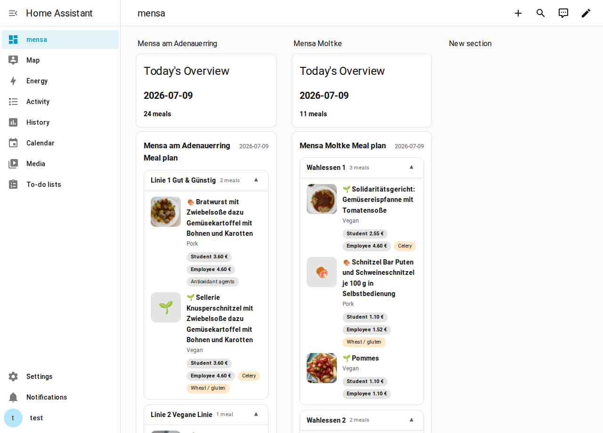

# Karlsruher Mensen for Home Assistant

[](https://github.com/xphil-22/ha-mensa-ka/actions/workflows/validate.yml)
[](https://github.com/xphil-22/ha-mensa-ka/actions/workflows/test.yml)
[](https://github.com/hacs/integration)

Home Assistant integration for meal plans from the canteens and cafeterias operated by Studierendenwerk Karlsruhe, including KIT, Hochschule für Musik, and other Karlsruhe/Pforzheim locations. It uses the public GraphQL API from [kronos-et-al/MensaApp](https://github.com/kronos-et-al/MensaApp) (`api.mensa-ka.de`).

For each selected canteen, the integration creates one **calendar entity** with a daily event whenever meals are offered. The event contains all meals for that day, grouped by serving line, including price, meal type (vegan, vegetarian, and so on), allergens, and additives.

The integration exposes an additional **sensor entity** per canteen as the primary dashboard-friendly representation. The calendar entity remains available for multi-day and agenda-style use.



## Features

- Config Flow setup directly in Home Assistant
- Support for multiple canteens and cafeterias in a single integration
- Calendar entities with daily meals, prices, allergens, and additives
- Sensor entities with structured meal attributes for dashboard rendering
- Self-registering `mensa-ka-card` Lovelace card for a native, richly styled meal-plan view
- HACS-compatible structure for simple installation
- Local Docker-based Home Assistant dev environment for UI testing

## Scope (v1)

The integration is **read-only**: it only fetches meal plans. According to the upstream API documentation in [`ApiAuth.md`](https://github.com/kronos-et-al/MensaApp/blob/main/doc/ApiAuth.md), mutations such as submitting ratings or uploading images require a signed request with an API key, and the process for obtaining that key is still not documented there. For that reason, these features are not implemented yet.

## Installation

### Via HACS (recommended)

1. In HACS, go to `Integrations -> Menu (⋮) -> Custom repositories`.
2. Add `https://github.com/xphil-22/ha-mensa-ka` as a repository with category `Integration`.
3. Install `Karlsruher Mensen` and restart Home Assistant.

### Manual

Copy the `custom_components/mensa_ka` folder into the `custom_components` directory of your Home Assistant configuration and restart Home Assistant.

## Setup

1. Go to `Settings -> Devices & Services -> Add Integration` and search for `Karlsruher Mensen`.
2. Select the canteens or cafeterias you want to track and choose how many days ahead should be fetched.
3. A device with both a calendar entity and a sensor entity is created for each selected canteen, for example `calendar.mensa_adenauerring` and `sensor.mensa_adenauerring_meal_plan`.

You can change the selected canteens at any time through the integration options.

## Dashboard View

The calendar entity is useful for agenda and multi-day navigation, but it is not ideal for a polished dashboard presentation because Home Assistant renders the event description as a large text block.

The sensor entity is designed to solve that:

- The calendar entity stays available for users who want an agenda-style overview.
- The sensor entity becomes the preferred dashboard-oriented view.
- The sensor state stays compact and automation-friendly.
- Structured attributes provide grouped meal data for custom cards, markdown cards, or template-based Lovelace layouts.

The intended sensor model per canteen is:

- State: number of meals for today, or the next available day with meals
- Attributes:
  - `day`
  - `lines`
  - each meal entry containing name, diet label, diet icon, prices, allergens, additives, and image URLs

This keeps the dashboard representation clean while preserving the richer multi-day browsing experience in the calendar entity.

## Custom Lovelace Card

The integration ships its own `mensa-ka-card` and registers it as a Lovelace resource automatically — there is nothing to add under `Settings -> Dashboards -> Resources`, it's available as soon as the integration is loaded.

Add one card per canteen to any dashboard:

```yaml
type: custom:mensa-ka-card
entity: sensor.mensa_adenauerring_meal_plan
```

Unlike a Markdown card, this card owns its own DOM instead of going through Home Assistant's Markdown sanitizer (which strips `style` attributes from embedded HTML), so the collapsible per-line sections, meal thumbnails, and price/allergen/additive chips actually render as designed, in both light and dark themes.

A paste-ready example with one card per canteen is available in [examples/dashboard/mensa_card_dashboard.yaml](examples/dashboard/mensa_card_dashboard.yaml).

## Example Dashboard

A Markdown-only fallback (no custom card, at the cost of a plainer layout since the sanitizer strips inline styles) is available in [examples/dashboard/mensa_dashboard.yaml](examples/dashboard/mensa_dashboard.yaml). It auto-detects every canteen you have configured via `integration_entities('mensa_ka')`, so it works unchanged for one canteen or ten — there is no entity id to edit, and nothing to duplicate when you add or remove a canteen in the integration options.

## Manual QA Checklist

For manual verification of the sensor implementation:

1. Restart the local Home Assistant dev container:
   `docker compose -f docker-compose.dev.yml up -d`
2. Open `http://localhost:8123`.
3. Verify that the integration now exposes a sensor entity in addition to the calendar entity.
4. Inspect the sensor attributes in Developer Tools and confirm that `day` and `lines` are populated as expected.
5. Add a `custom:mensa-ka-card` card for the sensor entity and confirm it renders without adding a Lovelace resource manually, then paste the example Markdown card into a test dashboard as a comparison.
6. Compare the resulting presentation with the current calendar-based popup and confirm that the sensor-based layout is easier to scan.

## Roadmap

- Visual card editor (`getConfigElement`) for `mensa-ka-card`, instead of YAML-only configuration
- Meal ratings once the upstream API key process is clarified
- Inclusion in [home-assistant/brands](https://github.com/home-assistant/brands) for a dedicated icon

## Development

```bash
python -m venv .venv
source .venv/bin/activate
pip install -r requirements_test.txt
ruff check custom_components tests
pytest tests/ -v
```

## Browser Test in a Local Home Assistant Instance

For a real UI test of the integration, a local Docker-based Home Assistant dev environment is included:

```bash
docker compose -f docker-compose.dev.yml up -d
```

Then open `http://localhost:8123` in your browser and complete the Home Assistant onboarding flow if no user exists yet. After that, go to `Settings -> Devices & Services -> Add Integration`, search for `Karlsruher Mensen`, and walk through the Config Flow.

Logs:

```bash
docker logs --tail 120 ha-mensa-ka-dev
```

## Repository

- Issues: [GitHub Issues](https://github.com/xphil-22/ha-mensa-ka/issues)
- Contributing: [CONTRIBUTING.md](CONTRIBUTING.md)
- Security: [SECURITY.md](SECURITY.md)

## License

MIT, see [LICENSE](LICENSE). The meal data originates from [Studierendenwerk Karlsruhe](https://www.sw-ka.de/) via the API from [kronos-et-al/MensaApp](https://github.com/kronos-et-al/MensaApp).
